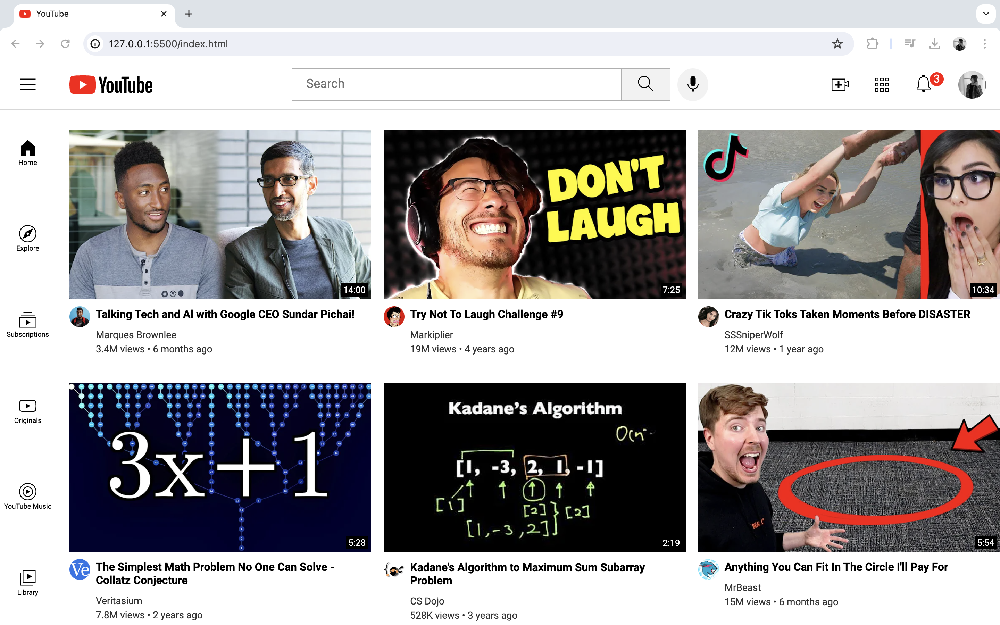

# YouTube Clone

A static clone of YouTube created using HTML and CSS, showcasing a user-friendly interface for a video streaming platform.

## Demo

## Features
- Mimics YouTube's home page layout.
- Responsive design.
- Display of video thumbnails with titles and views.
- Functional header with logo, search bar, and icons.

## License
This project is licensed under the MIT License.
